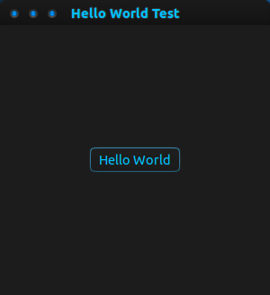

# c-gtk-tests
These are some various scripts I have written to learn how to use GTK+ with C.

## Table of Contents
1. [Hello World](#hello-world)

## Hello World
This is an application which creates a window containing a button, which when clicked prints out "Hello World" to the terminal.

I wrote this program to begin to familiarize myself with GTK+, and how to use it in conjunction with C. Through making it I learned how to create a window, set it's title, add buttons to it, and add functionality to buttons.

